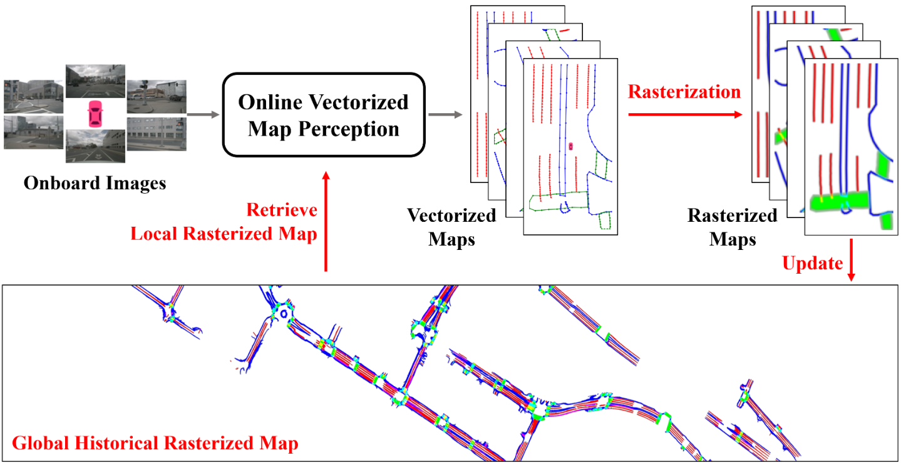

<div align="center">
<h1>HRMapNet</h1>
<h2>Enhancing Vectorized Map Perception with Historical Rasterized Maps</h2>

[Xiaoyu Zhang](https://fishmarch.github.io/)<sup>1*</sup>, 
Guangwei Liu<sup>2*</sup>,
Zihao Liu<sup>3</sup>, 
[Ningyi Xu](http://www.qingyuan.sjtu.edu.cn/a/xu-ning-yi-1.html)<sup>3</sup>,
[Yunhui Liu](https://www4.mae.cuhk.edu.hk/peoples/liu-yun-hui/)<sup>1</sup><sup>:envelope:</sup>,
[Ji Zhao](https://sites.google.com/site/drjizhao/)<sup>2#</sup>,

<sup>*</sup>Equal contribution. <sup>:envelope:</sup>Corresponding author. <sup>#</sup>Project lead

<sup>1</sup> The Chinese University of Hong Kong, 
<sup>2</sup> Huixi Technology,
<sup>3</sup> Shanghai Jiao Tong University

ArXiv Preprint ([arXiv 2409.00620](https://arxiv.org/abs/2409.00620))

Accepted by **ECCV 2024**

</div>

## Overview

This project introduces HRMapNet, leveraging a low-cost Historical Rasterized Map to enhance online vectorized map perception.
The historical rasterized map can be easily constructed from past predicted vectorized results and provides valuable complementary information.
To fully exploit a historical map, we propose two novel modules to enhance BEV features and map element queries.
For BEV features, we employ a feature aggregation module to encode features from both onboard images and the historical map. 
For map element queries, we design a query initialization module to endow queries with priors from the historical map.
The two modules contribute to leveraging map information in online perception.
Our HRMapNet can be integrated with most online vectorized map perception methods, significantly improving their performance on both the nuScenes and Argoverse 2 datasets.

### Example of online perception from an emplt map
<div align="center">
  
https://github.com/user-attachments/assets/42f7fbf5-9cf9-4032-a4f9-bdc91cfcb5fb

</div>

## Models
### MapTRv2 as Baseline
#### nuScenes dataset
|            Method            | Epoch | AP<sub>div</sub> | AP<sub>ped</sub> | AP<sub>bou</sub> | mAP  |            Initial Map            |                                 Config                                 |                                                                   Download                                                                   |
|:----------------------------:|:-----:|:----------------:|:----------------:|:----------------:|:----:|:---------------------------------:|:----------------------------------------------------------------------:|:--------------------------------------------------------------------------------------------------------------------------------------------:|
|    MapTRv2+<br/>HRMapNet     |  24   |       67.4       |       65.6       |       68.5       | 67.2 |               Empty               | [config](projects/configs/hrmapnet/hrmapnet_maptrv2_nusc_r50_24ep.py)  | [model](https://mycuhk-my.sharepoint.com/:u:/g/personal/1155168294_link_cuhk_edu_hk/EfE0RYUsZw1EuDS1xUxxYC0BPIBi0iOg_OEC-5UF2Ie-Ow?e=XeUdJp) |
|    MapTRv2+<br/>HRMapNet     |  24   |       72.1       |       73.0       |       73.9       | 73.0 |  [Testing Map](https://mycuhk-my.sharepoint.com/:u:/g/personal/1155168294_link_cuhk_edu_hk/ERIbHBFo-Z1LpCpPWOuzeZABdxVRnRozWSFWwfVLq-2ICA?e=dfsZIH)  | [config](projects/configs/hrmapnet/hrmapnet_maptrv2_nusc_r50_24ep.py)  | [model](https://mycuhk-my.sharepoint.com/:u:/g/personal/1155168294_link_cuhk_edu_hk/EfE0RYUsZw1EuDS1xUxxYC0BPIBi0iOg_OEC-5UF2Ie-Ow?e=XeUdJp) |
|    MapTRv2+<br/>HRMapNet     |  24   |       86.2       |       81.0       |       83.6       | 83.6 | [Training Map](https://mycuhk-my.sharepoint.com/:u:/g/personal/1155168294_link_cuhk_edu_hk/ESzjLmNYpklFncoTTJpo56wBb8_Al7sEvgobXkL-Cd9FPw?e=7HyadV) | [config](projects/configs/hrmapnet/hrmapnet_maptrv2_nusc_r50_24ep.py)  | [model](https://mycuhk-my.sharepoint.com/:u:/g/personal/1155168294_link_cuhk_edu_hk/EfE0RYUsZw1EuDS1xUxxYC0BPIBi0iOg_OEC-5UF2Ie-Ow?e=XeUdJp) |
|    MapTRv2+<br/>HRMapNet     |  110  |       72.7       |       72.2       |       75.7       | 73.5 |               Empty               | [config](projects/configs/hrmapnet/hrmapnet_maptrv2_nusc_r50_110ep.py) | [model](https://mycuhk-my.sharepoint.com/:u:/g/personal/1155168294_link_cuhk_edu_hk/EVn2qJ0NpWFMlyTxsM_jgjkB1zdhutfswygTN_5DZRV17Q?e=frd6ej) |

- To get the best performance, please use <strong>a single GPU</strong> for validation.
- By default, the global map is constructed from empty with online perception results.
- In practice, a well-constructed global map can be provided for much better results. 
Here, we provide two pre-built map, using testing data or training data. 
Note they are tested with the same model without re-training.
You can download the pre-built maps into the ``maps" folder or build by yourself.

#### Argoverse 2 dataset
|        Method         | Epoch | AP<sub>div</sub> | AP<sub>ped</sub> | AP<sub>bou</sub> | mAP  | Initial Map |                                Config                                |                                                                    Download                                                                    |
|:---------------------:|:-----:|:----------------:|:----------------:|:----------------:|:----:|:-----------:|:--------------------------------------------------------------------:|:----------------------------------------------------------------------------------------------------------------------------------------------:|
|        MapTRv2        |  30   |       68.7       |       60.0       |       64.2       | 64.3 |      -      |  [config](projects/configs/maptrv2/maptrv2_av2_r50_30ep.py)          |  [model](https://mycuhk-my.sharepoint.com/:u:/g/personal/1155168294_link_cuhk_edu_hk/ESk4lmKnqVVKl8E2M3bnAGgBvfawsCrz2_ST3GqdC9npmQ?e=ptYcoc)  |
| MapTRv2+<br/>HRMapNet |  30   |       71.4       |       65.1       |       68.6       | 68.3 |    Empty    | [config](projects/configs/hrmapnet/hrmapnet_maptrv2_av2_r50_30ep.py) | [model](https://mycuhk-my.sharepoint.com/:u:/g/personal/1155168294_link_cuhk_edu_hk/EU-PZSMMVINNnWpwgQohPmwB06dt6A3pqdSyV_qmzVdlgA?e=50JbUZ)   |

- We change the sensor frequency to 2 Hz for both training and testing, the same as in nuScenes. Thus, the setting here is different from that in original Map TRv2.

### MapQR as Baseline
Here we also provide results based on our [MapQR](https://github.com/HXMap/MapQR). This is not included in our paper.
#### nuScenes dataset
|     Method     | Epoch | AP<sub>div</sub> | AP<sub>ped</sub> | AP<sub>bou</sub> | mAP  |            Initial Map             |                          Config                          |                                                                    Download                                                                     |
|:--------------:|:-----:|:----------------:|:----------------:|:----------------:|:----:|:----------------------------------:|:--------------------------------------------------------:|:-----------------------------------------------------------------------------------------------------------------------------------------------:|
| MapQR+<br/>HRMapNet |  24   |       70.1       |       70.3       |       71.1       | 70.5 |               Empty                | [config](projects/configs/mapqr/mapqr_nusc_r50_24ep.py)  |  [model](https://mycuhk-my.sharepoint.com/:u:/g/personal/1155168294_link_cuhk_edu_hk/EesowqNmOgBNmzOdMpbjhisBI8Yj9YSqN9VEGItBVHJ3Dg?e=dMZ8Ab)   |


## Getting Started
These settings are similar with [MapTRv2](https://github.com/hustvl/MapTR/tree/maptrv2)
- [Installation](docs/install.md)
- [Prepare Dataset](docs/prepare_dataset.md)
- [Train and Eval](docs/train_eval.md)
- [Visualization](docs/visualization.md)


## Acknowledgements

MapQR is mainly based on [MapTRv2](https://github.com/hustvl/MapTR/tree/maptrv2) and [NMP](https://github.com/Tsinghua-MARS-Lab/neural_map_prior). 

It is also greatly inspired by the following outstanding contributions to the open-source community:
[BEVFormer](https://github.com/fundamentalvision/BEVFormer),
[MapQR](https://github.com/HXMap/MapQR),
[BoundaryFormer](https://github.com/mlpc-ucsd/BoundaryFormer).

## Citation
If you find this project is useful in your research or applications, 
please consider giving us a star 🌟 and citing it by the following BibTeX entry.
```bibtex
@inproceedings{zhang2024hrmapnet,
  title={Enhancing Vectorized Map Perception with Historical Rasterized Maps},
  author={Zhang, Xiaoyu and Liu, Guangwei and Liu, Zihao and Xu, Ningyi and Liu, Yunhui and Zhao, Ji},
  booktitle={European Conference on Computer Vision},
  year={2024}
}
```
